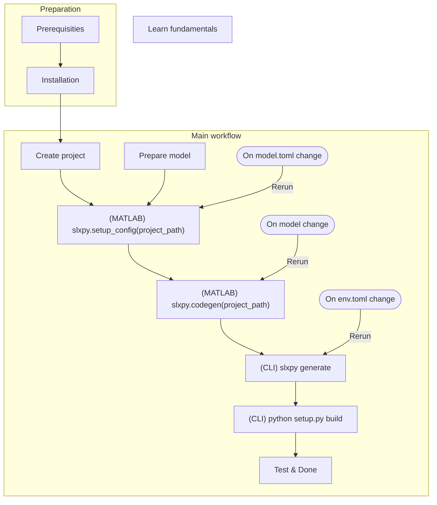

# SlxPy

[](https://pypi.org/project/slxpy-fork)
[](https://github.com/Pythoniasm/slxpy-fork)

Toolchain for seamlessly generating efficient Simulink-to-Python binding and gymnasium-like environment wrapper.

Forked from [`slxpy`](https://pypi.org/project/slxpy), the Simulink-to-Python C++ bindings generator as Python package and MATLAB toolbox:
[](https://pypi.org/project/slxpy)
[](https://www.mathworks.com/matlabcentral/fileexchange/100416-slxpy)

## Table of Contents
- [SlxPy](#slxpy)
  - [Table of Contents](#table-of-contents)
  - [Flowchart](#flowchart)
  - [Features](#features)
  - [Prerequisities \& Installation \& Quick start](#prerequisities--installation--quick-start)
    - [MATLAB](#matlab)
    - [Python](#python)
    - [C++ toolchain](#c-toolchain)
  - [Installation](#installation)
  - [Quick start](#quick-start)
  - [Modeling guide](#modeling-guide)
    - [Tunable parameter](#tunable-parameter)
    - [Limitations by Embedded Coder](#limitations-by-embedded-coder)
    - [Limitations by Slxpy](#limitations-by-slxpy)
  - [Gym Support](#gym-support)
    - [Model requirement](#model-requirement)
    - [env.toml](#envtoml)
      - [Basic setting](#basic-setting)
      - [Configure gym-simulink mapping and gym space](#configure-gym-simulink-mapping-and-gym-space)
      - [Control reset behavior to get initial observation](#control-reset-behavior-to-get-initial-observation)
      - [Define how parameters are initialized on each reset](#define-how-parameters-are-initialized-on-each-reset)
  - [Architecture](#architecture)
  - [FAQ](#faq)
    - [Numerous compiler errors about undefined identifier 'creal\_T' with Simscape](#numerous-compiler-errors-about-undefined-identifier-creal_t-with-simscape)
  - [Implementation note](#implementation-note)
    - [About stack allocation](#about-stack-allocation)
    - [About model class Copy/Move Constructible/Assignable](#about-model-class-copymove-constructibleassignable)
  - [Changelog](#changelog)


## Flowchart
The flowchart briefly describes common workflow for your smoother integration.



## Features

- Almost complete Simulink and Embedded Coder features support
- Compatible with a wide range of MATLAB versions
- Help tuning Simulink code generation config
- Mininal dependencies and cross-platform, not depending on MATLAB after Simulink code generation step
- Exchange array data with numpy for efficiency
- Raw and gymnasium (formerly gym) environment wrapper, with seeding and parameter randomization support
- Automatic single-node parallelization with vector environment
- Generate human-readable object `__repr__` for ease of use
- Automatically generate stub file to assist development (with pybind11-stubgen)
- Compile with all modern C++ compilers

## Prerequisities & Installation & Quick start

You need to prepare Python, optionally MATLAB and a C++ compiler to begin with slxpy.

### MATLAB

- Only needed for `Step 2` (Simulink to C++)

- **Version**: >= R2018a ( >= **R2021a** recommended )

  - **R2021a** may be the first version actually suitable for RL environment as it allows `instance parameters`. Previous versions of Embedded Coder will generates static parameters which might be difficult to use in a program (shared by all instances).
  - For version >= R2018a, limited support is added.

    MATLAB prior to R2021a will inline parameters defined in model workspace when C++ interface is chosen. The script has some logic to allow you to code as R2021 workflow, and maintain tunability on prior to R2021a releases, but the script may fail on the first run and work for following runs due to unknown reasons. (In R2021a it's far easier)

  - For version <= R2017b, some Simulink internal error prohibits proper code generation, thus unsupported.

  - MATLAB since **R2022a** supports **reusable Simscape model**, and slxpy provides corresponding support. Simscape enables powerful non-causal system modeling, which may be very useful for environment design.

    After Mathworks ticket 05353942 & 05373346, reusable C++ class in this release is an unintended bug, and only reusable C interface is officially supported. So, it may not yet work as expected. (Bug/Enhancement Submitted)

- **Toolbox**: Simulink, Embedded Coder, MATLAB Coder, Simulink Coder

### Python

- Almost always needed, except for `Step 2`
- **Version**: >= 3.8 (but generated binding can target Python 3.7)

  Slxpy uses a bunch of features added in Python 3.8

### C++ toolchain

- Needed for `Step 4` (Building C++)

  For `Step 2`, Embedded Coder does not depend on a C++ toolchain to generate code, but may display a warning for failing to generate build files, which is OK.

  For some MATLAB versions, however, if you are facing error like this:
  > The model is configured for C++ code generation, but the C-only compiler, LCC, is the default compiler. To allow code generation, on the Code Generation pane:
  >
  > 1. Select the 'Generate code only' check box.
  > 2. In the Toolchain field, select a toolchain from the drop-down list.

  it may be a logic error in Embedded Coder. Just select an alternative C++ toolchain other than LCC, even if it does not exist in your system.

- C++ 17 compatible compiler (one of)
  - for Windows, Visual Studio 2019 or newer
  - Clang 5 or newer
  - GCC 7 or newer

## Installation
You need to install two packages, one Python package for Python main logic, one MATLAB toolbox for MATLAB interop.

1. Install Python package with `pip install slxpy`

    It is recommanded to use slxpy with conda (to enable multi-target build) and install slxpy in an dedicated conda environment, i.e.
    ```
    conda create -n slxpy python=3.9
    conda activate slxpy
    pip install slxpy
    ```

2. Install MATLAB toolbox

	Downloading toolbox from [File Exchange link](https://www.mathworks.com/matlabcentral/fileexchange/100416-slxpy) and double-click it in MATLAB to install.

## Quick start

0. Prepare a Simulink model `foo.slx` suitable for code generation (See [docs/modeling.md](docs/modeling.md))

1. Project creation

   ```bash
   mkdir bar   # Create slxpy project folder, choose any name you like
   cd bar
   slxpy init  # Interactively fill up basic information
   ```

   Then adjust `model.toml` and `env.toml` as needed (See comments in file, and also [docs/env.md](docs/env.md)).

2. Simulink code generation

   ```matlab
   workdir = 'bar';             % Path to slxpy project folder
   slxpy.setup_config(workdir)  % Only need to be run for the first time
   slxpy.codegen(workdir)       % Code generation
   ```

3. Slxpy asset generation

   ```bash
   # Assuming still in bar folder
   slxpy generate
   ```

4. Build extension

   ```bash
   # Assuming still in bar folder
   python setup.py build
   ```

5. Test extension

   ```bash
   # Assuming still in bar folder
   cd build/lib<platform-suffix>
   python
   ```

   In Python REPL, run

   ```python
   # Substitute foo & bar to your corresponding model & project name
   import bar
   a = bar.fooModelClass()
   b = bar.RawEnv()
   c = bar.RawEnvVec()
   d = bar.GymEnv()
   e = bar.GymEnvVec()

   # Could also provide an EnvSpec similar to Gym's EnvSpec
   # Check stub or call help(bar._env.EnvSpec) for more options.
   spec = bar._env.EnvSpec(
       id='bar-v0',
       max_episode_steps=100,
       strict_reset=True,
   )
   env = bar.GymEnv(spec)
   ```


## Modeling guide

Slxpy follows standard simulink code generation process. So, if your model follows standard, minimal adjustments are required for proper code generation. So, detailed discussion about Simulink modeling is out of scope for this README, you shall refer to Simulink documentation for instructions.

To support gym environment generation, see Gym Support section.

### Tunable parameter

To make environment tunable, thus could have randomness, physical parameters, random seed, initial state of intergrator, etc shall be created with following two steps.

- Set them in `Model workspace` as `Simulink Parameter`. If it's a `MATLAB variable` rather than a `Simulink Parameter`, right-click entries, select `Convert to parameter object` to convert.
- Tick the `Argument` checkbox.

### Limitations by Embedded Coder

- S Function: You have to provide a `.tlc` file for S Function code generation, but `.tlc` is a difficult topic. So, I recommend using `MATLAB Function` block when possible.
- Fixed-step Solver: Variable-step solver do not support code generation in Embedded Coder. (Some models may get wrong simulation result in Fixed-step Solver if numeric condition is bad. Make sure to validate before code generation for proper results.)
- Algebraic Loop: Simulink could partially handle algebraic loop, but code generation does not. Try avoiding it using a `Unit Delay` or `Memory` block, or solve it iteratively in a `MATLAB Function` block.
- Variable-sized input: Embedded Coder C++ interface do not support it.
- Other blocks not supported by code generation, refer to Simulink documentation

### Limitations by Slxpy

- Variable-sized output: difficult to handle properly, currently not considered
- Fixed-point data: difficult to handle properly, currently not considered
- Bitfield: difficult to handle properly, currently not considered
- Event/function-call based system: difficult to handle properly, currently not considered

- String: string-related blocks are not supported. String `std::string` lead to non-POD struct in C++, breaking a fundemental assumption for Slxpy

Luckily, entries mentioned above might rarely be used in modeling.

## Gym Support

If modeling properly, Slxpy could generate gym environment with minimal configuration.

### Model requirement

- One inport of data type `double` (default) as **action**. Recommend to have exactly one inport, as additional inports will get zero input (meaningless).
- One output of data type `double` (default) as **observation**. Recommend to be the first outport.
- One scalar output of data type `double` (default) as **reward**. Recommend to be the second outport.
- One scalar output of data type `logical` as **done**. Recommend to be the third outport.
- Any additional outports of data type `double` (default) to be included in **info** dict.

### env.toml

Configuration file `env.toml` can be used to control various aspects of environment wrapping, including action_space, observation_space, initial observation and parameter initialization.

#### Basic setting

```toml
## Config version. DO NOT CHANGE.
__version__ = "1.0.0"

## Generate raw environment wrapper.
use_raw = true

## Generate gym-flavor environment wrapper (tensor action, tensor observation).
## NOTE: gym-flavor environment has to meet certain criteria. See "gym" section below.
use_gym = true

## Environment initialization needs randomness (generally true).
use_rng = true

## Generate vectorized wrapper over raw/gym environment.
use_vec = true
```

#### Configure gym-simulink mapping and gym space

```toml
## Configure gym-simulink mapping.
[gym]
    ## Action key in model inport(s).
    ## Data MUST be a double scalar or array.
    ## By default, the 1st inport is taken (Generally only one inport is sensible).
    ## Uncomment the line below to provide an alternative key.
    # action_key = "act"

    ## Observation key in model outports.
    ## Data MUST be a double scalar or array.
    ## By default, the 1st outport is taken.
    ## Uncomment the line below to provide an alternative key.
    # observation_key = "obs"

    ## Reward key in model outports.
    ## Data MUST be a double scalar.
    ## By default, the 2nd outport is taken.
    ## Uncomment the line below to provide an alternative key.
    # reward_key = "rew"

    ## Done key in model outports.
    ## Data MUST be a boolean (or logical in MATLAB) scalar.
    ## By default, the 3rd outport is taken.
    ## Uncomment the line below to provide an alternative key.
    # done_key = "done"

    ## Put additional outports to info dict.
    ## Option: true -> all additional outports are included
    ##         false -> empty info dict
    ##         list of keys -> selected outports are included, e.g. ["foo", "bar"]
    info = true

    ## Reward range, e.g. ["-inf", "inf"] | ["-inf", 0] | [-10, 10]
    reward_range = ["-inf", "inf"]

    ## Action space, similar to gym.space
    ## "type" includes: Box, Discrete, MultiDiscrete, MultiBinary
    [gym.action_space]
        type = "Discrete"
        n = 2

    ## Observation space, see action_space above
    [gym.observation_space]
        type = "Box"
        low = 0.0
        high = 1.0
        shape = [2, 2]
        dtype = "float64"
```

#### Control reset behavior to get initial observation

```toml
# Options controlling reset behavior
[reset]
    ## Take one step after environment initialization to get initial observation.
    ## If set to true/false, optionally provide a initializer for initial action/observation.
    first_step = true

    ## Only valid when "first_step = true".
    ## By default, initial action is initialized with "default initialization".
    ## Uncomment the line below to provide an "aggregate initialization" list.
    action = "{ 1.0 }"

    ## Only valid when "first_step = false".
    ## By default, initial observation is initialized with "default initialization"
    ## and might be affected by const block output optimization.
    ## Uncomment the line below to provide an "aggregate initialization" list.
    # observation = "{ 1.0 }"
```

#### Define how parameters are initialized on each reset

```toml
## A table to define individual parameter initialization policy
[parameter]
[parameter.seed_1]
    type = "seed"

[parameter.seed_2]
    type = "seed"

[parameter.constant_1]
    type = "constant"
    value = 1.0

[parameter.constant_2]
    type = "constant"
    value = "{ 1.0, 2.0, 3.0, 4.0, 5.0, 6.0 }"

[parameter.uniform_1]
    type = "uniform"
    low = 0.0
    high = 1.0

[parameter.uniform_2]
    type = "uniform"
    low = 0.0
    high = 1.0

[parameter.uniform_3]
    type = "uniform"
    low = [0.0, 0.2, 0.4, 0.6, 0.8, 1.0]
    high = 1.0

[parameter.uniform_4]
    type = "uniform"
    low = 0.0
    high = [0.0, 0.2, 0.4, 0.6, 0.8, 1.0]

[parameter.uniform_5]
    type = "uniform"
    low = [0.0, 0.2, 0.4, 0.6, 0.8, 1.0]
    high = [0.0, 0.2, 0.4, 0.6, 0.8, 1.0]

[parameter.custom]
    type = "custom"
    code = "std::fill_n(params.custom, 6, -1);"
```

## Architecture
- Frontend: Convert source to IR
- Backend: Generate Pybind11 binding with IR and modern C++ features, using Jinja2 for template generation

## FAQ
### Numerous compiler errors about undefined identifier 'creal_T' with Simscape
Try to set simulink feature `complex` to `true` in `model.toml`.
Though Embedded Coder did not complain, some Simscape (multibody) functions may implicitly depend on complex structs `c*_T`.
This may be a flaw of Mathworks product design.

## Implementation note
### About stack allocation
Simulink structs could have arbitrary size, ranging from only one scalar field to a large array storing an image,
previous implementation (88b504f and previous) has unintended stack allocations,
which causes stack overflow and immediate abort for large structs.

After identifying the problem, stack allocations are changed to heap allocation and placement new.

### About model class Copy/Move Constructible/Assignable
Simulink generated C++ class do not forbid these four default constructors, but pointers in RTModel may point to
invalid locations if `initialize` is not called again.
So, avoid calling these four default constructors explicitly or implicitly.

## Changelog

- v1.6.0.post1
  - New versioning scheme, forks from slxpy are now labeled as same version with a `.postN` suffix.
  - Baseline for fork. (No change from original Python implementation slxpy==v1.6.0)

- v1.6.1.post1
  - Updated fork to slxpy==v1.6.1

- v1.6.1.post2
  - Based on v1.6.1.post1 with some improvements (the old fork version labeled slxpy==v1.6.2 is similar to slxpy-fork==v1.6.0.post1).
  - Added model name and version via Jinja2 template of `setup.py` for better package management of compiled models.
  - Multi-line `json` files with indentations of four whitespaces for proper support of git tracking generated models.

- v1.6.1.post3
  - Minor changes to package information
